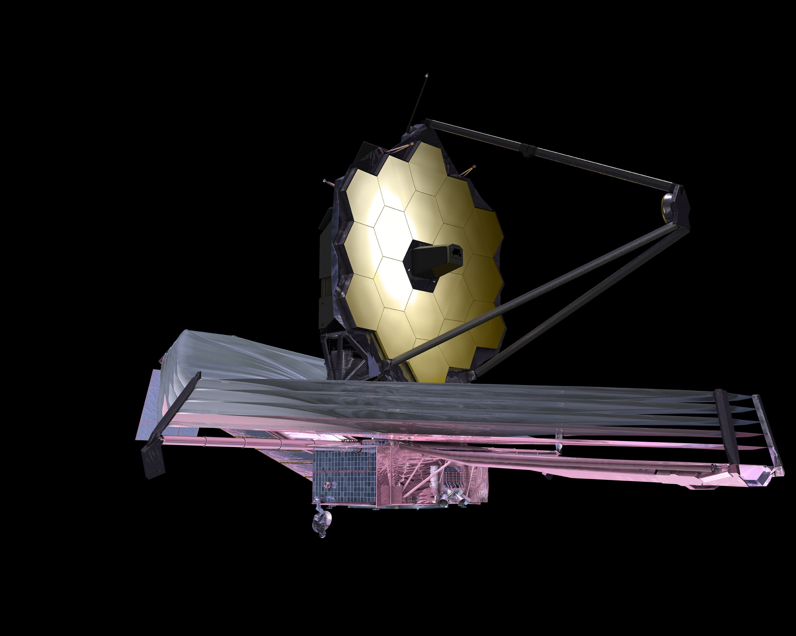
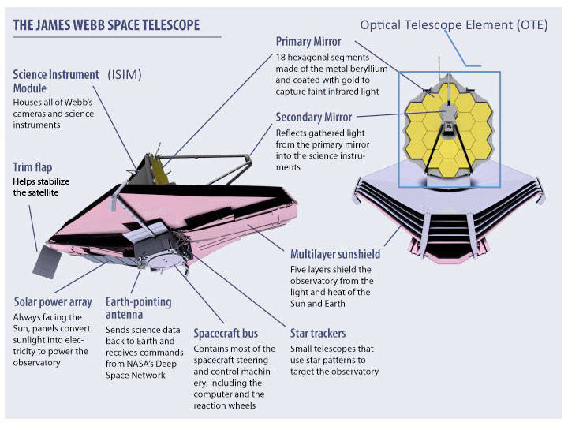
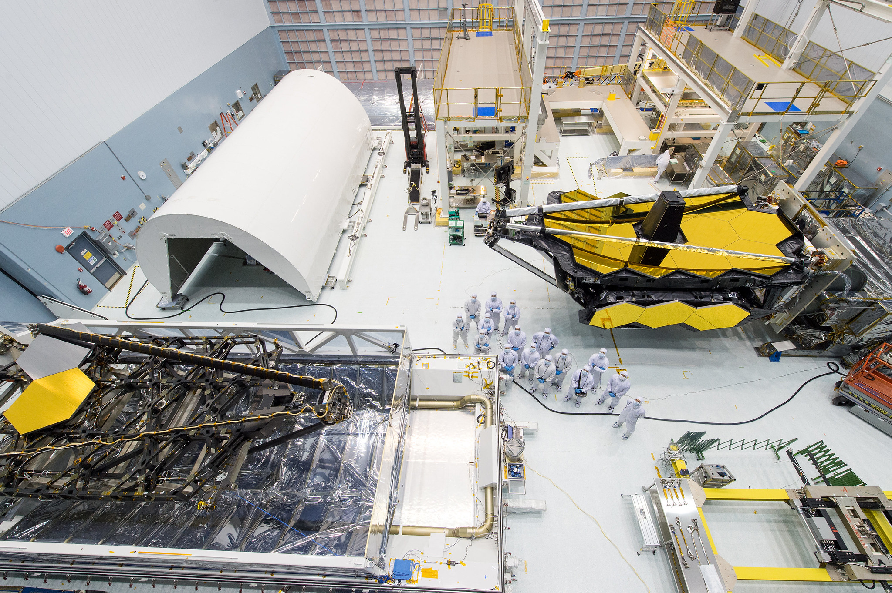
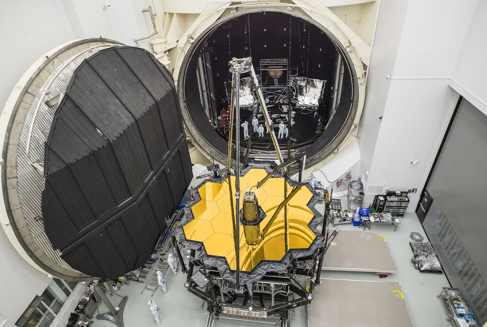
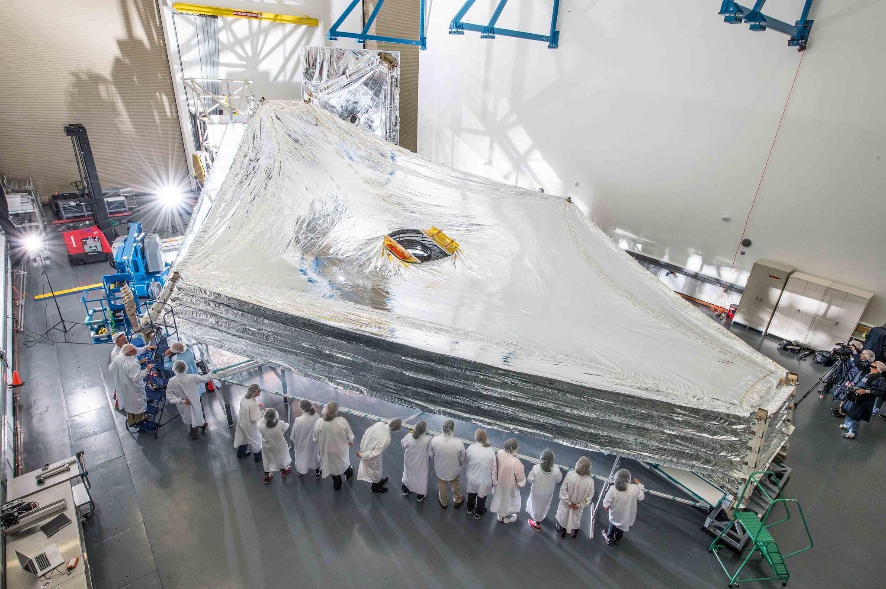
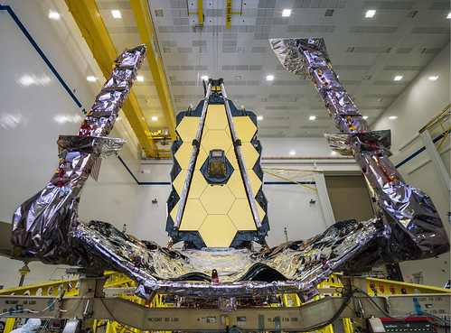
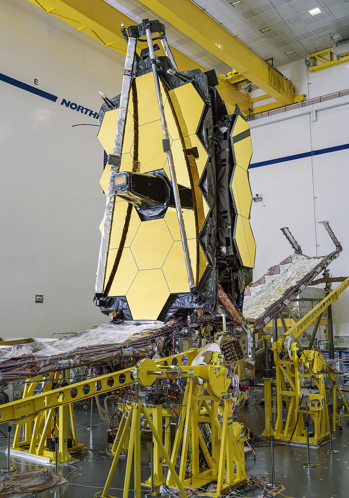
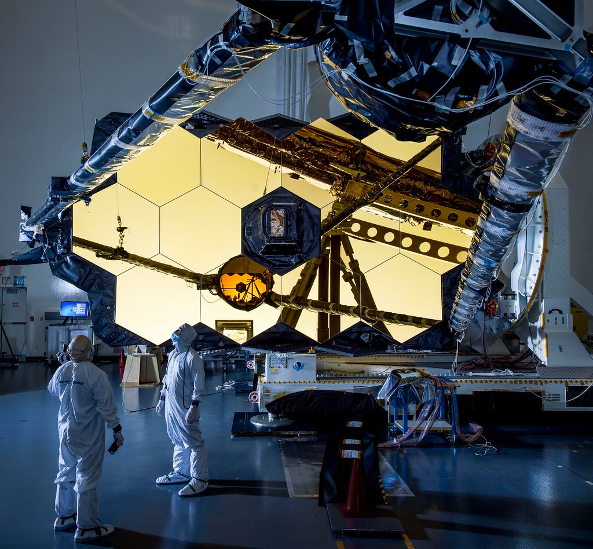
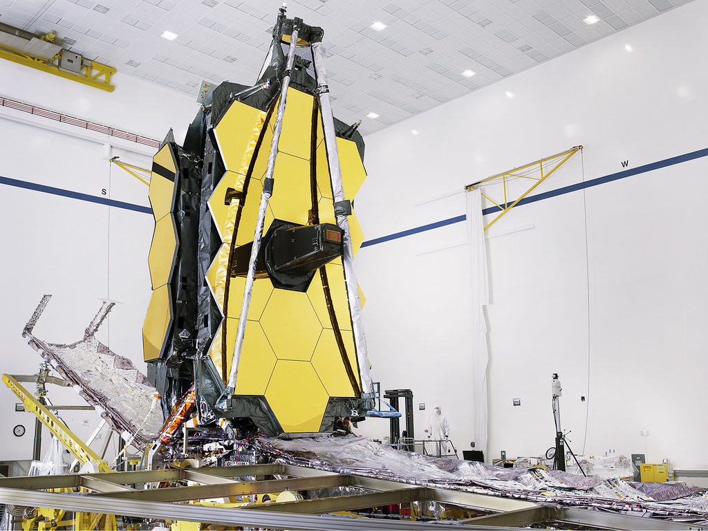

<!DOCTYPE html>
<!-- saved from url=(0070)https://www.w3schools.com/w3css/tryw3css_templates_dark_portfolio.htm# -->
<html><head><meta http-equiv="Content-Type" content="text/html; charset=UTF-8"><title>James Webb Space Telescope</title>

<meta name="viewport" content="width=device-width, initial-scale=1">
<link rel="stylesheet" href="./Index_files/w3.css">
<link rel="stylesheet" href="./Index_files/css">
<link rel="stylesheet" href="./Index_files/font-awesome.min.css">

</head><body class="w3-black">

<!-- Icon Bar (Sidebar - hidden on small screens) -->
<nav class="w3-sidebar w3-bar-block w3-small w3-hide-small w3-center">
  <!-- Avatar image in top left corner -->
  
  <a href="index.html#" class="w3-bar-item w3-button w3-padding-large w3-black">
    <i class="fa fa-home w3-xxlarge"></i>
    
HOME

  </a>
  <a href="index.html#about" class="w3-bar-item w3-button w3-padding-large w3-hover-black">
    <i class="fa fa-user w3-xxlarge"></i>
    
ABOUT

  </a>
  <a href="index.html#photos" class="w3-bar-item w3-button w3-padding-large w3-hover-black">
    <i class="fa fa-eye w3-xxlarge"></i>
    
PHOTOS

  </a>
  <a href="index.html#contact" class="w3-bar-item w3-button w3-padding-large w3-hover-black">
    <i class="fa fa-envelope w3-xxlarge"></i>
    
CONTACT

  </a>
</nav>

<!-- Navbar on small screens (Hidden on medium and large screens) -->

  

    <a href="index.html#" class="w3-bar-item w3-button" style="width:25% !important">HOME</a>
    <a href="index.html#about" class="w3-bar-item w3-button" style="width:25% !important">ABOUT</a>
    <a href="index.html#photos" class="w3-bar-item w3-button" style="width:25% !important">PHOTOS</a>
    <a href="index.html#contact" class="w3-bar-item w3-button" style="width:25% !important">CONTACT</a>
  

<!-- Page Content -->

  <!-- Header/Home -->
  <header class="w3-container w3-padding-32 w3-center w3-black" id="home">
    <h1 class="w3-jumbo">I'm James Webb Space Telescope.</h1>
    
The next generation space telescope.

    
  </header>

  <!-- About Section -->
  

    <h2 class="w3-text-light-grey">About</h2>
    

    

    <h3>The Premier Observatory Of The Next Decade</h3>
    The James Webb Space Telescope (sometimes called JWST or Webb) will be a large infrared telescope with a 6.5-meter primary mirror.  The telescope will be launched on an Ariane 5 rocket from French Guiana in 2021.

    Webb will be the premier observatory of the next decade, serving thousands of astronomers worldwide. It will study every phase in the history of our Universe, ranging from the first luminous glows after the Big Bang, to the formation of solar systems capable of supporting life on planets like Earth, to the evolution of our own Solar System.

    Webb was formerly known as the "Next Generation Space Telescope" (NGST); it was renamed in Sept. 2002 after a former NASA administrator, James Webb..
    <h3>International Collaboration</h3>
    Webb is an international collaboration between NASA, the European Space Agency (ESA), and the Canadian Space Agency (CSA). The NASA Goddard Space Flight Center is managing the development effort. The main industrial partner is Northrop Grumman; the Space Telescope Science Institute will operate Webb after launch.

    <h3>Innovative Technologies</h3>
    Several innovative technologies have been developed for Webb. These include a primary mirror made of 18 separate segments that unfold and adjust to shape after launch. The mirrors are made of ultra-lightweight beryllium. Webb’s biggest feature is a tennis court sized five-layer sunshield that attenuates heat from the Sun more than a million times. The telescope’s four instruments - cameras and spectrometers - have detectors that are able to record extremely faint signals. One instrument (NIRSpec) has programmable microshutters, which enable observation up to 100 objects simultaneously. Webb also has a cryocooler for cooling the mid-infrared detectors of another instrument (MIRI) to a very cold 7 K so they can work.
    

    
<h3> Details</h3>
    The Observatory of the James Webb Space Telescope is comprised of three elements: the Integrated Science Instrument Module (ISIM), the Optical Telescope Element (OTE), which includes the mirrors and backplane, and the Spacecraft Element, which includes the Spacecraft Bus and Sunshield.
     

    
    

    
The Integrated Science Instrument Module (ISIM) includes Webb's science instruments. The OTE is the eye of the Observatory and it gathers the light coming from space and provides it to the science instruments located in the ISIM. The backplane is like the Webb's "spine". It supports the mirrors. 

    The sunshield subsystem separates the observatory into a warm sun-facing side (spacecraft bus) and a cold anti-sun side (OTE and ISIM). The sunshield keeps the heat of the Sun, Earth, and spacecraft bus electronics away from the OTE and ISIM so that these pieces of the Observatory can be kept very cold (The operating temperature has to be kept under 50 kelvins or -370 deg F). 

    The Spacecraft Bus provides the support functions for the operation of the Observatory. The bus houses the six major subsystems needed to operate the spacecraft: the Electrical Power Subsystem, the Attitude Control Subsystem, the Communication Subsystem, the Command and Data Handling Subsystem, the Propulsion Subsystem, and the Thermal Control Subsystem. 

    The momentum flap balances the solar pressure on the sunshield, like a trim flap in sailing. It's not adjustable on orbit, but it is while it's on the ground.

  
  <!-- Portfolio Section -->
  

    <h2 class="w3-text-light-grey">My Photos</h2>
    

    <!-- Grid for photos -->
    

      

        
        
        
        
      

      

        
        
        
        
      

    <!-- End photo grid -->
    

    <a href="https://jwst.nasa.gov/Webb3d/" target="_blank"><h3> Launch 3D Model</h3></a>
    Requires flash
  <!-- End Portfolio Section -->
  

  <!-- Contact Section -->
  

    <h2 class="w3-text-light-grey">Contact Me</h2>
    

    

      
<i class="fa fa-map-marker fa-fw w3-text-white w3-xxlarge w3-margin-right"></i> Juiz de Fora, BR

      
<i class="fa fa-phone fa-fw w3-text-white w3-xxlarge w3-margin-right"></i> Phone: +32 99103-6216

      
<i class="fa fa-envelope fa-fw w3-text-white w3-xxlarge w3-margin-right"> </i> Email: jcma9000@gmail.com

    
 
    
Lets get in touch. Send me a message:

    <form action="https://www.w3schools.com/action_page.php" target="_blank">
      
<input class="w3-input w3-padding-16" type="text" placeholder="Name" required="" name="Name">

      
<input class="w3-input w3-padding-16" type="text" placeholder="Email" required="" name="Email">

      
<input class="w3-input w3-padding-16" type="text" placeholder="Subject" required="" name="Subject">

      
<input class="w3-input w3-padding-16" type="text" placeholder="Message" required="" name="Message">

      

        <button class="w3-button w3-light-grey w3-padding-large" type="submit">
          <i class="fa fa-paper-plane"></i> SEND MESSAGE
        </button>
      

    </form>
  <!-- End Contact Section -->
  

  
    <!-- Footer -->
  <footer class="w3-content w3-padding-64 w3-text-grey w3-xlarge">
    <i class="fa fa-facebook-official w3-hover-opacity"></i>
    <i class="fa fa-instagram w3-hover-opacity"></i>
    <i class="fa fa-snapchat w3-hover-opacity"></i>
    <i class="fa fa-pinterest-p w3-hover-opacity"></i>
    <i class="fa fa-twitter w3-hover-opacity"></i>
    <i class="fa fa-linkedin w3-hover-opacity"></i>
    
Powered by <a href="https://www.w3schools.com/w3css/default.asp" target="_blank" class="w3-hover-text-green">w3.css</a>

  <!-- End footer -->
  </footer>

<!-- END PAGE CONTENT -->

Salvar</body></html>
